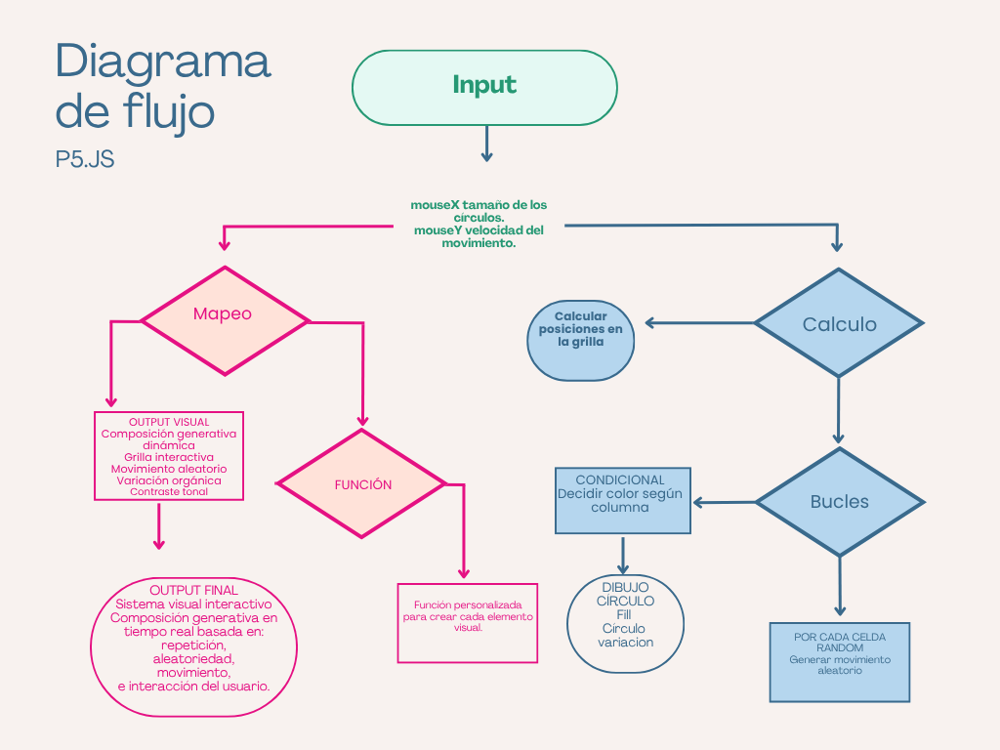
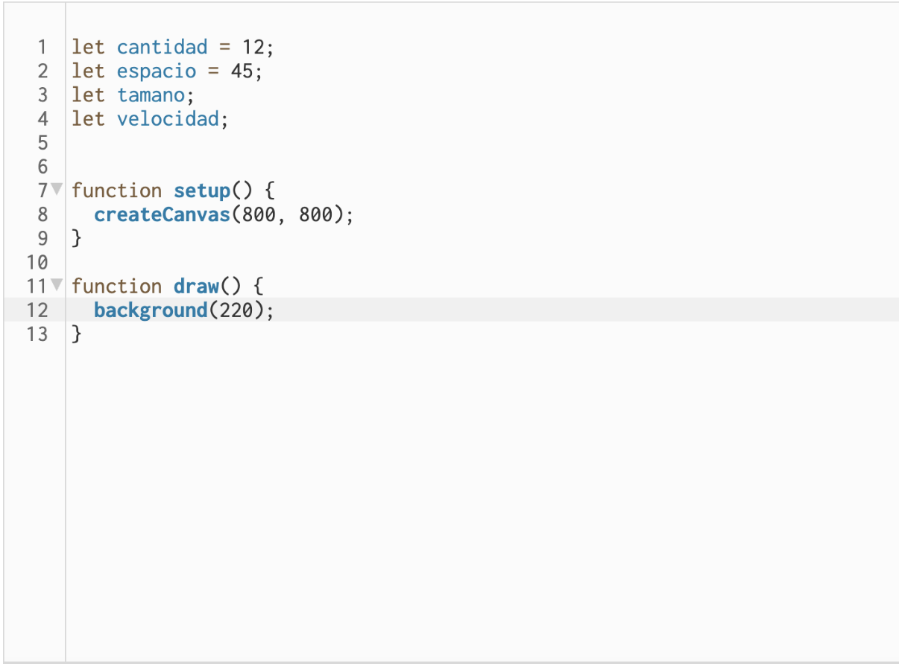
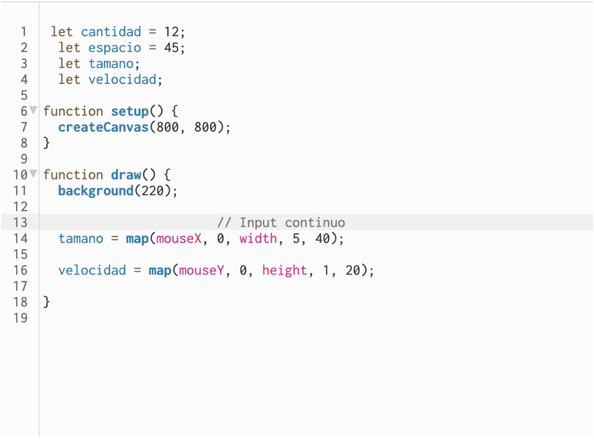
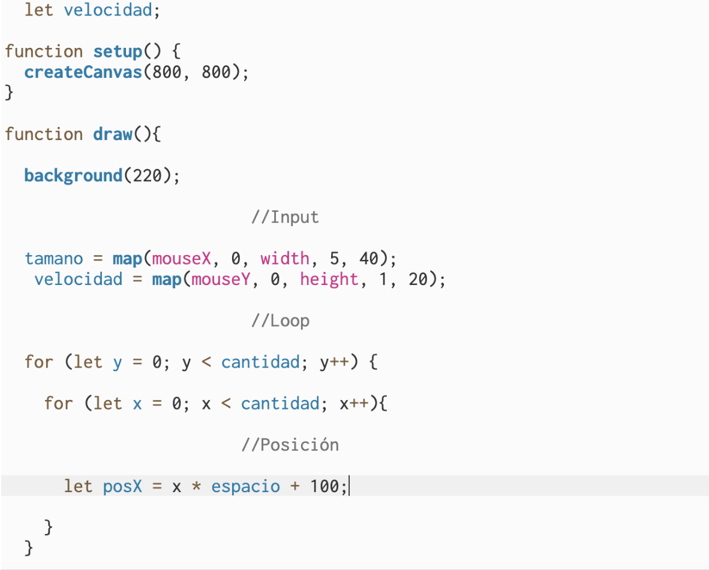
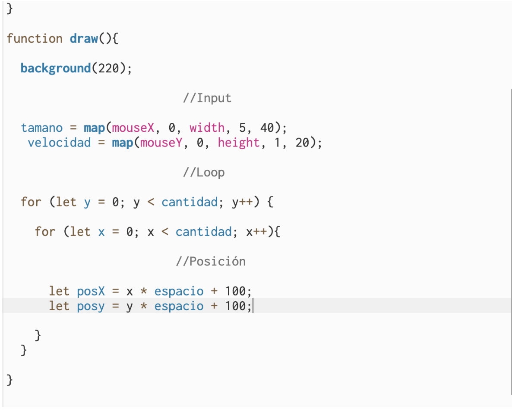
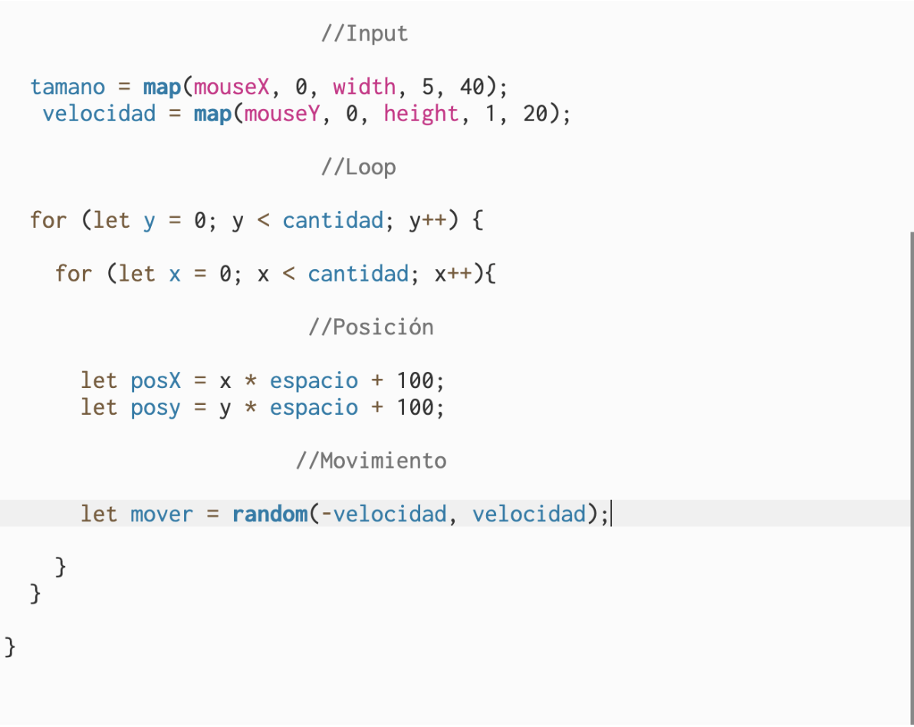
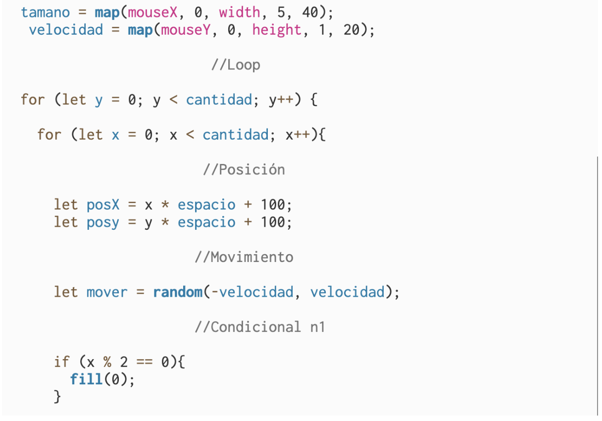
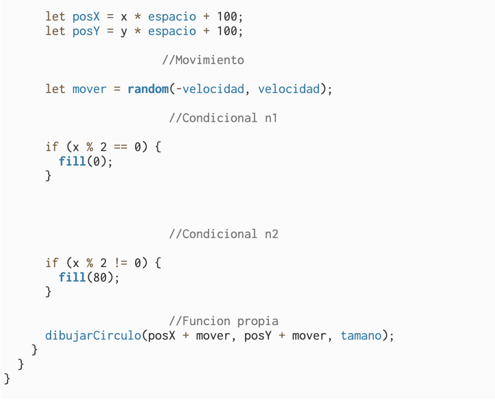
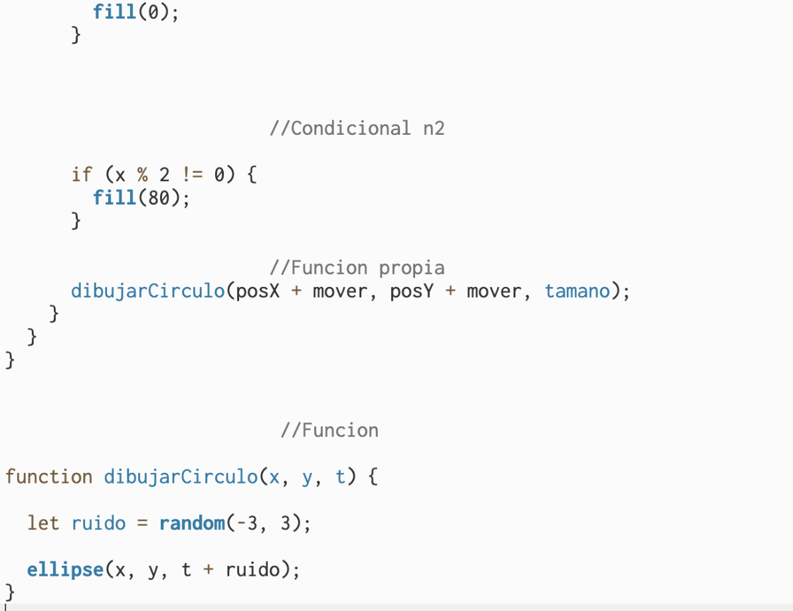
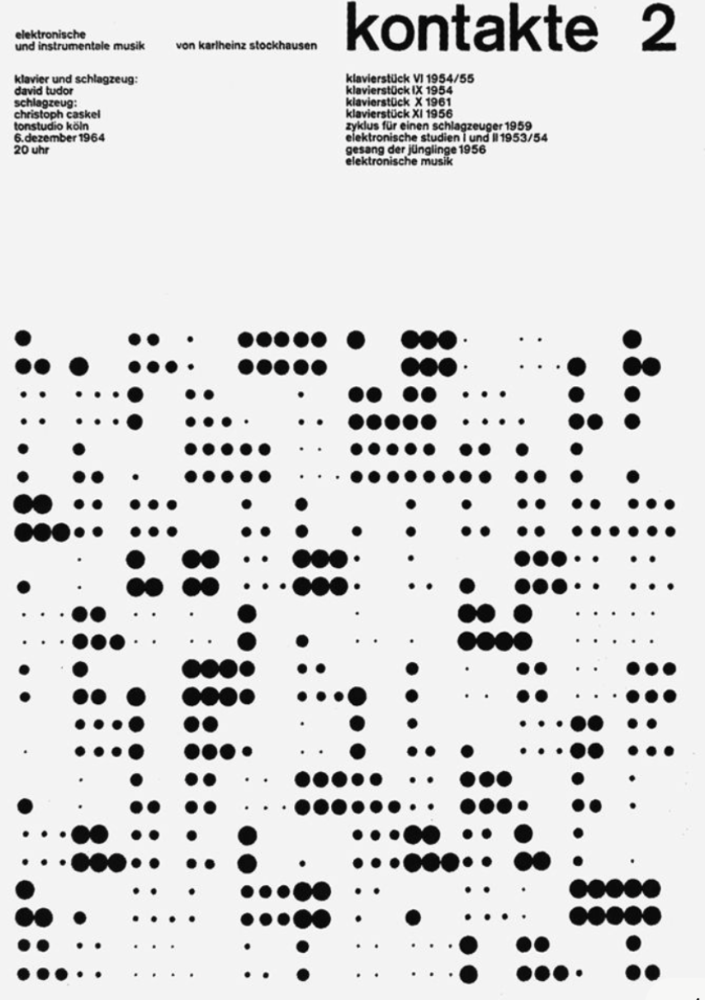

# SOLEMNE-II
# Sistema Visual Bauhaus — Kontakte 2
Autor: Martina Chacana

[p5.js link editable](https://editor.p5js.org/martinulia/sketches/XarAHmQB-)

[Archivo js en repositorio github](sketch.js)

**Diagrama de flujo**

**Documentación del proceso P5.JS**

## Información del proyecto
Es un sistema visual dinámico e interactivo realizado en p5.js inspirado en el afiche Kontakte 2 de Karlheinz Stockhausen y la estética Bauhaus/HfG Ulm. El sistema utiliza reglas simples de repetición modular para generar movimiento y variaciones visuales en tiempo real. 

**¿Qué se ve en pantalla?**

Se observa una grilla de círculos distribuidos ordenadamente sobre el espacio. Los círculos cambian de tamaño y posición constantemente dependiendo del movimiento del mouse.

**¿Qué elementos visuales aparecen?**

- Círculos
- Repetición modular
- Grilla geométrica
- Variaciones de tamaño
- Movimiento dinámico
- Composición minimalista en blanco y negro

**¿Qué inputs utiliza?**

- MouseX 
- MouseY

**¿Qué outputs genera?**

- Cambio de tamaño de los círculos
- Movimiento aleatorio
- Variación visual constante
- Cambios compositivos dinámicos

**Descripción conceptual**

El proyecto busca traducir la lógica visual modular de la Bauhaus y de los sistemas gráficos de la HfG Ulm a un lenguaje computacional interactivo.
En vez de copiar solamente la estética del afiche, el sistema utiliza reglas, repeticiones y variaciones para generar una composición viva y cambiante.

**Corriente o referente de diseño con el que dialoga**
- Bauhaus
- diseño moderno
- diseño generativo
- HfG ulm

  **Referentes visuales, teóricos e históricos**

 
 - Kontakte 2 Karlheinz Stockhausen (AUTORA)
- Afiche basado en estructuras modulares, repetición geométrica y organización visual racional.
- Bauhaus
- Escuela que exploró la geometría, funcionalidad y sistemas visuales simples.
- HfG Ulm
- Continuación del pensamiento Bauhaus desde una lógica más sistemática y computacional.
- referentes de la pagina p5js
- youtube Patt vira
-  The coding train

  
[Video referencia Patt vira](https://www.youtube.com/@pattvira)

[Video referencia The coding train](https://www.youtube.com/@TheCodingTrain)

**Principio de diseño explorado**

- Repetición
- Modularidad
- Variación
- Sistema visual
- Geometría
- Interactividad

 **Input / Output y sistema
  Reglas que gobiernan el sistema**

El sistema utiliza una grilla de círculos generada mediante loops for.
Cada círculo cambia de tamaño y posición dependiendo de:
la posición del mouse
valores aleatorios
condiciones establecidas mediante if

**Explicación de la interactividad**

El movimiento horizontal del mouse modifica el tamaño de los círculos.
El movimiento vertical modifica la intensidad del desplazamiento aleatorio.

**Qué datos entran**
- Posición X del mouse
- Posición Y del mouse

**Cómo se procesan y transforman**
Los datos son transformados usando map() para convertir el movimiento del mouse en nuevos valores visuales.
Luego random() genera pequeñas variaciones para producir movimiento dinámico.

**Qué respuesta visual producen**
- Crecimiento y disminución de círculos
- Vibración visual
- Cambios constantes en la composición
- Sensación de sistema vivo y reactivo

